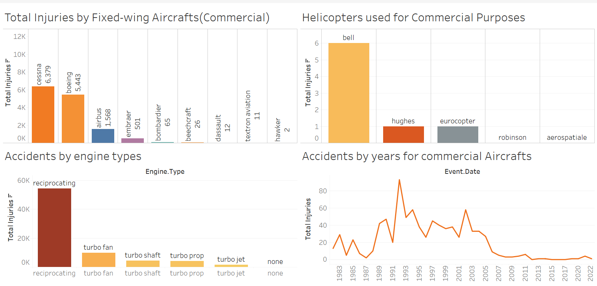

# Phase 1 Project 

## Aviation Risk Analysis Project Overview 

This project focuses on analyzing aviation data to assist a company in expanding into the aviation industry. 
By evaluating historical aircraft incidents and injuries, actionable insights are provided to guide the purchase of safe and reliable aircraft for commercial and corporate operations.

### Business Problem

Your company is expanding in to new industries to diversify its portfolio. Specifically, they are interested in purchasing and operating airplanes for commercial and private enterprises, but do not know anything about the potential risks of aircraft. You are charged with determining which aircraft are the lowest risk for the company to start this new business endeavor. You must then translate your findings into actionable insights that the head of the new aviation division can use to help decide which aircraft to purchase.

### Objectives 

1. Conduct Comprehensive Data Analysis:
- Apply univariate, bivariate, and multivariate analyses to identify  trends, relationships, and patterns in aviation incident data to assess risks effectively.
2. Provide Insights Across Multiple Dimensions:
- Examine individual variables, relationships between pairs of variables, and multi-variable interactions to develop a holistic understanding of risk factors affecting aircraft safety.
3. Deliver Actionable Recommendations:
- Leverage findings from the analysis to recommend low-risk aircraft models and operational strategies, ensuring informed decision-making for entry into the aviation industry.

### Data

Data source: AviationData.csv 
I performed cleaning for analysis purposes and narrowed down to the following key variables.

Key Variables:

- Event.Date 
- Location
- Country 
- Injury Severity
- Aircraft damage
- Aircraft Category 
- Make
- Model
- Amateur Built
- Number of Engines
- Engine Type
- Purpose of flight 
- Total Fatal Injuries
- Total Serious Injuries
- Total Minor Injuries
- Total Uninjured
- Weather Condition
- Phase of flight

## Analysis Approach

#### Univariate Analysis: 
- Examined individual variables (e.g., total injuries by make).
#### Bivariate Analysis: 
- Explored relationships between pairs of variables (e.g., total injuries and weather conditions).
#### Multivariate Analysis: 
- Combined multiple variables for a comprehensive understanding (e.g., injuries by make, purpose, and flight phase).

### Tools and Techniques

#### Python: 
- Data cleaning, exploratory analysis, and visualizations (Matplotlib, Seaborn). 
#### Tableau: 
- Interactive dashboards for in-depth insights into commercial and corporate aviation risks. 
#### Git: 
- Version control and collaboration.

## Interactive Dashboard

Below is a dashboard used to come up with commercial aircraft analysis

Next is a dashboard that was used to come up with corporate aircraft insights

Corporate Dashboard.png

## Analysis

Injuries by Make.png

Injuries by years.png

Accidents by Purpose of Flight.png

## Insights from the analysis

- Certain makes and models are associated with higher injury rates.
- Weather conditions significantly impact accident severity.
- Commercial aircraft tend to have more incidents compared to corporate operations, but specific models within each category vary in risk.
- Boeing Aircraft has more fatal accidents compared to the rest.
- Aircrafts that are not Amarteur built have a high accident rate
- Most accidents occur during cruising, takeoff, approach and maneuvering.
- United States has more accident reports.
- Reciprocating engines have more accidents 
- Helicopters are widely used for corporate purposes unlike commercial
- Accidents have decreased over the years hence more safety standards.
- Safety is a big priority in the aviation industry starting from the manufacturing sector.
- Cessna aircrafts lead as the aircrafts with the most accidents

### Recommendations

- For commercial use: 
I)  Airbus aircrafts have a lower risk and have relatively more safety features compared to its rivals.
II) Helicopters are not recommended.
- For corporate use: 
I) avoid Cessna and Piper makes.
II) Airbus helicopter is recommended, including Bell helicopters which are widely used and also versatile.
- Aircrafts with 1 to 4 engines are more safe.
- Safety protocols should be observed during the takeoff, cruising, approach and landing phases of the flight.
- Crew members should be properly trained to operate the aircrafts.

### Next Steps

- Extend the analysis by including variables such as; aircraft age, maintenance frequency, year of manufacture in the data.
- There is a lot of unknown values in the important columns affecting the analysis
- Avoid repetition of data eg beech, beech aircraft, beech aircraft co., beech aircraft corp, beech aircraft corporation, Beechcraft, Beechcraft corporation meaning the same thing hence affecting the analysis. 
- Validate my findings through real-world testing and industry expert feedback.
